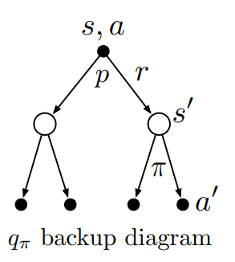

## Exercise 3.5 
Give a table analogous to to Table 3.1, but for p(s', r|s, a). It should have columns for s, a, s', r, and p(s', r|s, a), and a row for every 4-tuple for which p(s', r|s, a) > 0. 

### Solution

| s    | a         | s'   | r            | p(s', r\|s, a) |
| :--- | :-------- | :--- | :----------- | :------------- |
| high | search    | high | $r_{search}$ | $\alpha$       |
| high | search    | low  | $r_{search}$ | $1-\alpha$     |
| low  | search    | high | $-3$         | $1-\beta$      |
| low  | search    | low  | $r_{search}$ | $\beta$        |
| high | wait      | high | $r_{wait}$   | 1              |
| low  | wait      | low  | $r_{wait}$   | 1              |
| low  | reacharge | high | 0            | 1              |

## Exercise 3.13 
What is the Bellman equation for action values, that is, for $q_π$? It must give the action value $q_π(s, a)$ in terms of the action values, $q_π(s', a')$, of possible successors to the state–action pair $(s, a)$. Hint: the backup diagram to the right corresponds to this equation. Show the sequence of equations analogous to (3.14), but for action values.

### Solution

$$
\begin{aligned}

  q_{\pi}(s,a) &= \mathbb{E_{\pi}}[G_t|S_t=s,A_t=a] \\

    &= \mathbb{E_{\pi}}[R_{t+1} + \gamma G_t+1|S_t=s,A_t=a] \\

    &= \sum_{s'}\sum_{r}p(s',r|s,a) \big[ r + \gamma \mathbb{E_{\pi}}[G_{t+1} |S_{t+1} = s'] \big] \\

    &= \sum_{s'}\sum_{r}p(s',r|s,a) \big[ r + \gamma \sum_{a'}\pi(a'|s')\mathbb{E_{\pi}}[G_{t+1}|S_{t+1}=s,A_{t+1}=a'] \big] \\

    &= \sum_{s'}\sum_{r}p(s',r|s,a)[r + \gamma \sum_{a'}\pi(a'|s')q_\pi(s',a')]

\end{aligned}
$$

# Exercises not sure
- Ex3.4 
- Ex3.7

# Exercises to do
- Ex2.7
- Ex2.9
- Ex3.1
- Ex 3.14-3.17
- Ex 3.18-3.26
- 